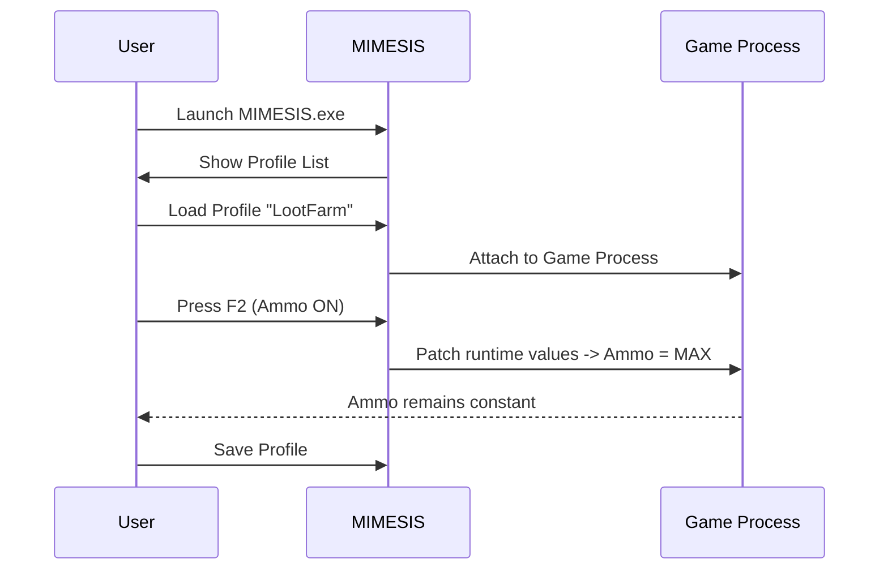

# MIMESIS Trainer — Advanced Loot & Economy Utility

MIMESIS Trainer is a professional-grade **tool** for PC players who want consistent, reliable in-session control over inventory, ammo, durability, and currency. Built for stability and ease of use, it ships with profile management, a compact overlay, and hotkey-driven toggles so you can tailor each play session without fuss.


[](#)
---

## ⚡️ Core Feature Highlights

* [x] **Unlimited Item Ammo** — Never run out of usable charges or consumables.
* [x] **Unlimited Item Durability** — Keep gear at max effectiveness indefinitely.
* [x] **Unlimited Currency** — Instantly adjust in-game currency balances for easier testing or progression.
* Precision toggles, per-game profiles, and instant overlay feedback make all changes visible and reversible.

> [!IMPORTANT]
> Features apply per-profile and are only active while MIMESIS is attached to the target game process. Always use profiles responsibly and follow applicable rules for multiplayer environments.

---

## Overview

MIMESIS focuses on three practical categories: resource permanence (ammo/durability), economy control (currency), and workflow (profiles + macros). The tool is designed to be unobtrusive — the overlay only appears when you need it and supports layered configs to suit different titles or builds.

### Quick snapshot

* Real-time toggles with hotkeys
* Exportable `.mimprofile` config files
* Lightweight overlay (DirectX/Vulkan friendly)
* Admin/diagnostic logging for reproducible testing


---

## Compatibility & Accessibility

| Platform              |          Status | Accessibility Notes                               |
| --------------------- | --------------: | ------------------------------------------------- |
| Windows 11 / 10 (x64) |  ✅ Full support | Overlay scaling, high-DPI aware                   |
| Steam Deck (Proton)   |      ⚠️ Partial | Requires custom mapping and Proton tweaks         |
| Linux (native)        | ⚙️ Experimental | Use at your own risk; CLI profile tools available |
| MacOS                 |   ❌ Unsupported | No native build planned currently                 |

> [!NOTE]
> For best results on Windows, run MIMESIS as Administrator and enable overlay privileges in your GPU control panel.

---

## Setup — Fast Start (60 seconds)

1. Download the latest verified release and extract to a folder you control.
2. Run `MIMESIS.exe` (right-click → Run as Administrator).
3. Select the target game process from the dropdown and click **Attach**.
4. Load or create a profile and toggle the features you want.

Example `MIMESIS.ini` snippet:

```ini
[Profile_Default]
UnlimitedAmmo = true
UnlimitedDurability = true
UnlimitedCurrency = true
Hotkey_ToggleOverlay = F1
Hotkey_UnlimitedAmmo = F2
Hotkey_UnlimitedDurability = F3
Hotkey_UnlimitedCurrency = F4
```

---

## Profile & Workflow Diagram



---

## Advanced Usage & Tips

* **Layered Profiles:** Combine a base profile (shared toggles) with game-specific overlays to keep settings tidy.
* **Safe Test Mode:** Use `Diagnostic Mode` to preview value changes without committing them — great for troubleshooting.
* **Macro Sequences:** Create an auto-replenish macro to restore durability every X minutes for longer tests.
* **Export/Import:** Share `.mimprofile` configs with the team for consistent QA setups.

---

## FAQ

**Q: Are these changes permanent in save files?**
A: No — by default MIMESIS operates on memory/runtime values. Some games persist changes to save files depending on how they handle memory writes; always back up saves before experimenting.

**Q: Will this get me banned in online multiplayer?**
A: Using trainers in multiplayer is risky and typically against service terms. MIMESIS is intended for single-player, local testing, and mod-enabled sessions. Use discretion.

**Q: How do I revert changes quickly?**
A: Toggle the feature off or use the profile reset command. The overlay also includes a one-click Restore Defaults option.

**Q: What if my game updates and MIMESIS fails to attach?**
A: Switch to Diagnostic Mode to get suggested offsets, or load an updated profile. The development channel provides frequent offset patches for major titles.

**Q: Can I automate currency changes?**
A: Yes — use the Auto-Sequence Engine to schedule periodic currency adjustments or bind values to hotkeys.

---

## Final Thoughts & Call to Action

MIMESIS Trainer is built to be a dependable, repeatable utility for players and testers who need robust control over ammo, durability, and currency. Its profile-first approach keeps workflows organized while the overlay and hotkeys provide instant access to core toggles.

[](#) [](#)

---

## Legal & Safety Reminder

[!WARNING] MIMESIS is a local utility. Using similar tools in online, competitive, or licensed environments may violate terms of service and can lead to account penalties. The authors are not responsible for misuse—use this tool for testing, single-player enjoyment, or with explicit permission.

---

**Get control. Keep playing. Explore MIMESIS Trainer now.**
